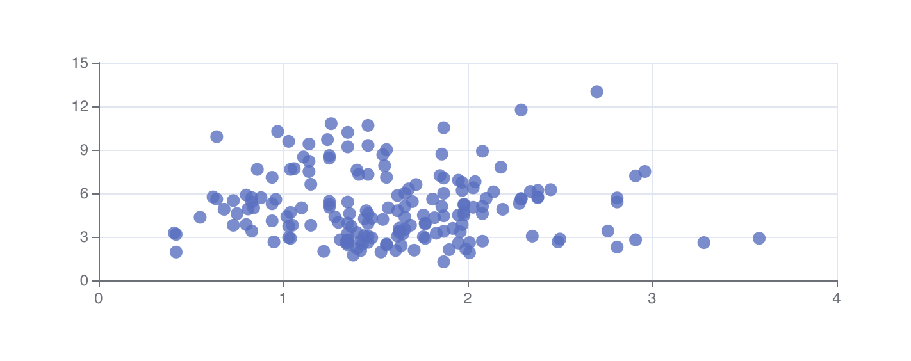
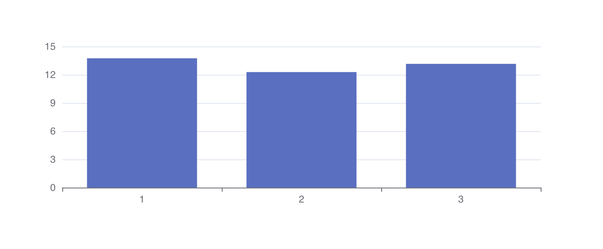

# Data Visualization Task

## Dependencies

 `echarts-for-react`
 `echarts`

## Available Scripts

In the project directory, you can run:

### Firstly clone this repo 

`git clone https://github.com/whovishnu/data-visualization.git`

### Run `npm install` or `yarn` for install dependencies

### `yarn start`  or  `npm start`

Runs the app in the development mode.\
Open [http://localhost:3000](http://localhost:3000) to view it in the browser.

### `npm run build`

Builds the app for production to the `build` folder.\

